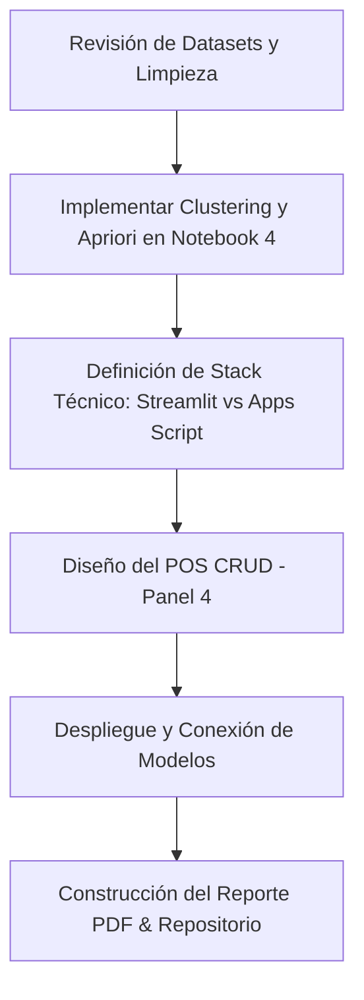

# Análisis de Contexto y Guía de Proyecto: SmartBazar

Este documento consolida el estado actual del proyecto **SmartBazar - Optimización de Ventas y Flujo de Caja**, alineando las directrices académicas de la asignatura de **Minería de Datos (UNMSM - 2026-I)** con los datos reales y el avance de los modelos. Su objetivo es servir como mapa de ruta para las siguientes fases de diseño y desarrollo.

---

## 1. El Problema y los Datos (Originalidad Local)

El proyecto resuelve un problema real en un bazar/librería peruano utilizando datos transaccionales propios (no extraídos de repositorios genéricos como Kaggle o UCI). Esto asegura los **2 puntos** de la rúbrica de *Originalidad del dataset y relevancia local*.

### Resumen del Inventario y Ventas
* **Transacciones reales:** ~850 ventas con más de 1,140 detalles de productos y un catálogo de más de 900 artículos.
* **Dolores del negocio:** 
  1. **Exceso de stock inmovilizado:** Productos en estantes que no rotan (pérdida de liquidez).
  2. **Falta de efectivo (sencillo):** Dificultad para estimar si los pagos serán con Yape o Efectivo, lo que afecta el cambio físico disponible en caja.

### Auditoría Técnica de los Datasets (`/datasets`)
1. **ventas.csv** (854 registros):
   * **Variables:** `ID`, `Fecha`, `Metodo_Pago`, `ID_Cliente`, `Total`.
   * **Proporción de Pago:** **66.3% Efectivo** (566 transacciones) vs. **33.7% Yape** (288 transacciones). Hay un desbalance de clases que debe ser considerado (e.g. usando `class_weight='balanced'` o similar en los modelos).
2. **detalle-ventas.csv** (1,146 registros):
   * **Variables:** `ID_Venta`, `ID_Producto`, `Departamento`, `Descripcion`, `Cantidad`, `Precio_Unitario`, `Subtotal`, `Fecha`, `Medio`.
   * **Advertencia de Limpieza:** El archivo contiene un prefijo BOM y campos vacíos/delimitadores duplicados debido a la exportación, lo que genera columnas fantasma tipo `Unnamed`. El código del modelo ya implementa un filtro `~df.columns.str.contains('^Unnamed')` para corregir esto.
3. **Inventario.csv** (929 registros):
   * **Variables:** `ID`, `Descripcion`, `Categoria`, `Departamento`, `Unidad`, `Costo_Unitario`, `Ubicacion`, `Proveedor`, `Fecha Ingreso`, `Estado`, `Precio_Venta`, `Stock_Minimo`, `Stock_Actual`.
   * **Limpieza necesaria:** Al igual que el detalle de ventas, cuenta con una primera fila de delimitadores vacíos y un punto y coma inicial que desplaza el dataset. Se debe cargar aplicando `skiprows=1` y eliminando columnas vacías.

### Estrategia de EDA y Flujo de Datos (`datasets/crudo` vs `datasets/limpio`)
Para mantener el proyecto ordenado, reproducible y permitir el trabajo en paralelo del equipo sin interferencias ni acoplamientos innecesarios, se ha consensuado la siguiente arquitectura de datos:
1. **EDA General y Limpieza Estructural (Macro):**
   * Se evalúa el contexto general del negocio analizando integralmente las ventas, inventario y detalle de ventas desde `datasets/crudo/`.
   * Se resuelven problemas de exportación estructurales (BOM UTF-8, delimitadores vacíos, columnas `Unnamed`, conversión canónica de fechas y tipos numéricos).
   * La data estructurada y validada se exporta como insumo oficial a `datasets/limpio/`.
2. **EDA Específico y Preparación por Panel/Modelo (Micro):**
   * Cada panel o cuaderno especializado (Clustering, Reglas de Asociación, Clasificación Método de Pago, Series Temporales) parte leyendo de `datasets/limpio/`.
   * **Preparación interna:** Cada modelo realiza las imputaciones de nulos, tratamiento de outliers, codificación de variables categóricas o agregaciones específicas dentro de su propio pipeline, garantizando que los ajustes o cambios en un modelo no afecten a los demás integrantes del equipo.

---

## 2. Requerimientos de la Rúbrica de la UNMSM (5 Puntos Código)

El dashboard en línea debe estructurarse obligatoriamente en **4 paneles**:

| Panel | Requerimiento Mínimo | Estado en el Proyecto |
| :--- | :--- | :--- |
| **Panel 1: EDA + Clustering** | Estadísticas descriptivas, histogramas, mapas de correlación, boxplots, outliers (1.5 IQR), agrupamiento K-means (con **Método del codo** y **Coeficiente de silueta**). | **Completado en Cuadernos Divididos.** Dividido en `Panel 1A_ Auditoria_y_Limpieza_Datos.ipynb` (auditoría profunda, head/nulos, corrección de fechas por digitación en lote, stocks negativos y stock mínimo) y `Panel 1B_ EDA_y_Clustering.ipynb` (ingeniería de características por ticket, outliers 1.5·IQR y clustering K-Means con silueta 0.95). |
| **Panel 2: Predictivo** | Comparación de $\ge$ 2 modelos (Random Forest vs XGBoost), matriz de confusión (TP, TN, FP, FN), métricas de evaluación (Accuracy, Precision, Recall, F1, ROC-AUC), y gráfico explicativo global/local con **SHAP** o **LIME**. | **Completado en Notebook.** `Panel 2_ Prediccion_Metodo_Pago.ipynb` compara RF y XGBoost, genera matriz de confusión, métricas y gráficos SHAP. El modelo está exportado en `/models/modelo_metodo_pago.pkl`. |
| **Panel 3: Pronóstico** | Serie temporal graficada, predicción de $\ge$ 4 periodos futuros, reporte de **MAPE** y **RMSE** visible en pantalla. Modelos: Media móvil, suavizado exponencial, ARIMA o Prophet. | **Completado en Notebook.** `Panel 3_ Series temporales.ipynb` aplica Prophet y Media Móvil de 7 días, maneja valores no negativos post-procesados, calcula RMSE/MAPE e imprime comparaciones. |
| **Panel 4: CRUD Caja** | Formulario para registrar consultas (entradas + predicción devuelta), visor de lista, botones de editar, eliminar e inserción de timestamp automático. Guardado en Google Sheets o Firebase. | **Estructura preliminar en JSON.** Existe el esqueleto básico en Google Apps Script (`Dashboard - Smart Bazar.json`). |

---

## 3. Estado y Análisis de los Modelos de Machine Learning

### 📈 Clasificación: Predicción del Método de Pago (Panel 2)
El objetivo es predecir si una venta será pagada mediante **YAPE (1)** o **EFECTIVO (0)** basándose en variables como `Total` (monto), `hora_compra`, `n_items`, `n_productos_distintos`, `departamento_principal_enc`, `pct_fotocopiadora`, `dia_semana` y `es_fin_de_semana`.
* **Random Forest (RF):** Ajustado con `class_weight='balanced'` para manejar la proporción 66/34. Max_depth=6.
* **XGBoost (XGB):** Ajustado con `scale_pos_weight` calculated dinámicamente (~1.96). Max_depth=4.
* **XAI (Inteligencia Explicable):** Se utiliza `shap.TreeExplainer` sobre el mejor modelo (evaluado con F1-score) para mostrar el *summary plot* de importancia y el impacto de variables.
* **Modelo final:** Serializado como un diccionario que contiene el clasificador entrenado, el `LabelEncoder` de departamentos, y el orden de columnas.

### ⏱️ Series Temporales: Pronóstico de Ingresos (Panel 3)
El objetivo es pronosticar el flujo de efectivo diario para los siguientes **7 días**.
* **Preprocesamiento:** Conversión robusta de fechas con múltiples formatos, reindexación de fechas diarias completas y relleno de días sin ventas con valor `0`.
* **Prophet:** Configurado con crecimiento lineal. Debido a que el modelo puede predecir valores negativos en días con bajas transacciones previas, se incluye un **post-procesamiento crítico** (`yhat = max(x, 0)`) para asegurar coherencia lógica financiera.
* **Evaluación:** Se aparta una ventana de prueba de los últimos 30 días (`test_size=30`). Prophet se compara contra una **Media Móvil histórica de 7 días**, calculando RMSE y MAPE.

### 🧩 Clustering y Reglas de Asociación (Panel 1)
* **Estado:** Se debe desarrollar en el archivo `Panel 4_ Clustering.ipynb` (sugiero renombrarlo a `Panel 1_ Clustering_Asociacion.ipynb` para evitar confusiones en los nombres).
* **Propósito:**
  1. **Segmentación de tickets:** Agrupar las ventas con K-Means para identificar perfiles de consumo (ej. compra rápida en fotocopiadora vs. compra mayorista de útiles). Requisitos de rúbrica: Método del codo y Coeficiente de silueta.
  2. **Reglas de asociación:** Implementar el algoritmo **Apriori** (usando `mlxtend` u otra librería) sobre las canastas de compra para identificar qué ítems se adquieren en combo y sugerir promociones.

---

## 4. Reto de Arquitectura: Google Apps Script vs. Exigencias de la Rúbrica

> [!WARNING]
> ### 🚨 El Punto Crítico: Modificación en Vivo (8 Puntos)
> La rúbrica establece que el profesor llamará a un integrante del grupo para hacer una **modificación del código en tiempo real** (ej. cambiar el split train/test de 70/30 a 90/10, o el valor de $K$ en clustering), ejecutarlo y explicar qué ocurrió en la visualización del dashboard.

Si desarrollamos el dashboard usando el **Stack B (Google Apps Script + Sheets)**:
1. **Modelos Locales en JS:** Si exportamos los modelos entrenados en Python a JSON (e.g. con `sklearn-porter` u otras herramientas) para ejecutarlos directamente en el navegador con JavaScript, **perdemos la capacidad de reentrenar interactivamente**. Si el profesor pide cambiar el split train/test a 90/10 o modificar el número de estimadores en vivo, no podremos correr scikit-learn o xgboost directamente en Apps Script.
2. **API REST Externa:** Si los modelos corren en un backend Python (e.g. FastAPI/Flask en Render, Hugging Face o local vía ngrok) y Google Apps Script hace llamadas fetch a esta API, la modificación del código en vivo requeriría cambiar el script Python, desplegarlo (o guardar en local con recarga automática) y recargar el dashboard. Aunque es viable, añade latencia y complejidad durante la exposición.

### Alternativa Estratégica (Stack A)
Si el profesor lo permite, **Streamlit Cloud (Stack A)** reduce enormemente este dolor:
* Se edita el archivo `app.py` directamente en la interfaz de GitHub en un par de clics, o el grupo trabaja compartiendo pantalla local con su IDE favorito.
* El dashboard se auto-actualiza en vivo en el navegador.
* Todo el código del pipeline de modelamiento (scikit-learn, XGBoost, Prophet, SHAP) vive directamente en el mismo archivo o en scripts del mismo repositorio.

> **Recomendación de Asesoría:** Sugiero confirmar con el profesor si es obligatorio usar Google Apps Script (como menciona el esqueleto en JSON) o si se puede optar por Streamlit, justificando que facilita la visualización interactiva en tiempo real y la modificación de hiperparámetros exigida en la rúbrica. Si es obligatorio Google Apps Script, diseñaremos un puente API ligero en Python para resolver la inferencia y el entrenamiento dinámico.

---

## 5. Próximos Pasos (Hoja de Ruta)

1. **Limpieza y Carga Formal:** Establecer una función de carga uniforme para `detalle-ventas.csv` e `Inventario.csv` libre de caracteres fantasma y BOM.
2. **Desarrollo del Panel 1 (Notebook):** Implementar la segmentación de clientes con K-Means (evaluando codo y silueta) y el algoritmo Apriori para reglas de asociación en el notebook vacío.
3. **Decisión del Puente de Ejecución:** Evaluar el mecanismo de predicción del POS (Panel 4) y la forma en que los modelos en Python se comunicarán con el dashboard.
