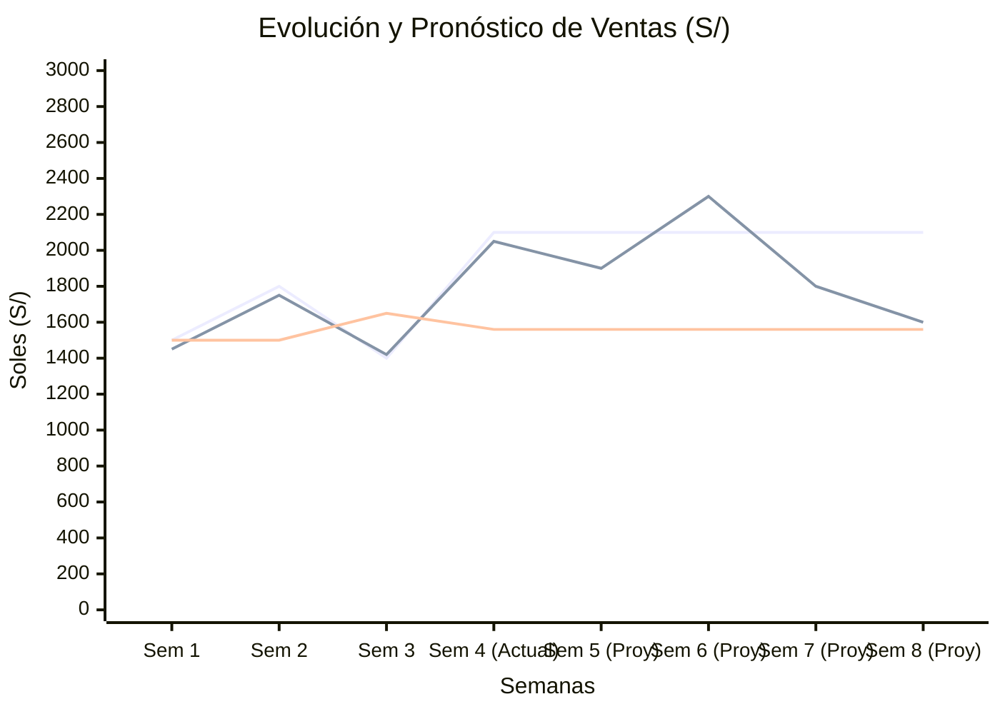

# Documentación de `panel_forecast.py`

El archivo `panel_forecast.py` es el módulo principal encargado de la generación y visualización del panel de series temporales (pronóstico de ingresos) en el dashboard de **Smart Bazar**. Este documento detalla las librerías empleadas, las variables clave, el flujo de procesamiento de datos, la arquitectura de la Interfaz de Usuario (IU) y los detalles técnicos de la evaluación del modelo.

---

## 1. Librerías Empleadas

El módulo importa diversas librerías especializadas para el manejo de datos, modelos y visualización:

* **Manipulación de Datos y Fechas:**
  * `pandas` y `numpy`: Fundamentales para la manipulación estructurada de la serie temporal (agregaciones semanales, cálculo de logaritmos y exponenciales, ventanas móviles).
  * `dateutil.parser`: Para un parseo robusto de fechas, manejando ambigüedades en formatos de día/mes.
  * `holidays`: Se utiliza para obtener automáticamente los días festivos nacionales de Perú (`holidays.country_holidays("PE")`).

* **Carga de Modelos y Serialización:**
  * `joblib` y `pickle`: Utilizadas para cargar el modelo predictivo serializado desde la carpeta `models/`.
  * `pathlib`: Para el manejo seguro de rutas relativas y absolutas en el sistema de archivos.

* **Visualización e Interfaz de Usuario:**
  * `streamlit` (`st`): El framework principal que estructura y renderiza el dashboard interactivo web.
  * `plotly.graph_objects` (`go`): Utilizado para la creación del gráfico principal interactivo de la serie temporal, permitiendo visualizaciones limpias con bandas de incertidumbre (fill).
  * `matplotlib.pyplot` (`plt`): Utilizado para generar gráficos estáticos complementarios, como los gráficos de barras comparativos de los errores (RMSE y MAPE) en la pestaña de evaluación.

---

## 2. Variables y Estructuras de Datos Aplicadas

### Variables de Entrada y Transformación
* `df_raw`: DataFrame bruto importado desde los archivos CSV originales de ventas.
* `weekly_df`: Serie temporal agrupada en intervalos semanales (`W-SUN`). Contiene columnas como `ds` (fecha) e `y` (ingresos agregados).
* `reg_df`, `hols_df`, `school_df`: DataFrames que codifican variables binarias (regresores exógenos) indicando la presencia de feriados (`is_nat`) o periodos escolares (`is_school`).

### Variables del Modelo y Predicción
* `model`: El objeto del modelo predictivo (Prophet) cargado en memoria.
* `ma_params`: Diccionario con los hiperparámetros del modelo de línea base (Media Móvil), como el tamaño de la ventana (`window`).
* `yhat_original`, `yhat_lower_original`, `yhat_upper_original`: Representan las predicciones del modelo Prophet ya transformadas a la escala real monetaria (soles) tras aplicar la función `expm1()`, revirtiendo la regresión logarítmica inicial.
* `ma_pred`: Representa la predicción obtenida mediante el modelo de Media Móvil simple.

### Variables de Evaluación de Modelos
* `prophet_rmse`, `prophet_mape`: Almacenan las métricas de error calculadas en la ventana de prueba (Backtesting) para el modelo Prophet.
* `ma_rmse`, `ma_mape`: Almacenan las métricas de error para el modelo de Media Móvil.

---

## 3. Flujo de Funcionamiento del Sistema (Con Ejemplos)

El flujo analítico dentro de `panel_forecast.py` se divide en fases consecutivas que se disparan en tiempo de ejecución:

### 1. Extracción, Limpieza y Normalización de Fechas
Se importan los datos transaccionales brutos, parseando las fechas cronológicas de forma inteligente y limpiando los valores nulos o posteriores al día de ejecución. 

**Algoritmo de Normalización de Fechas (`parsear_fechas_cronologicas`)**
Dado que los sistemas de registro manuales o POS mal configurados pueden registrar fechas ambiguas (por ejemplo, `04/05/2026` puede ser 4 de mayo o 5 de abril), este algoritmo utiliza un **enfoque de coherencia cronológica**. Mantiene en memoria la "fecha anterior" válida y, frente a una ambigüedad, prefiere la interpretación que mantenga la secuencia temporal avanzando hacia adelante (sin retroceder en el tiempo de forma brusca).

```python
def parsear_fechas_cronologicas(fechas):
    """
    Toma una lista de fechas en formato string y devuelve una lista validada
    y desambiguada de objetos datetime.
    """
    fechas_limpias = []
    # Inicializamos la fecha anterior en el mínimo posible para empezar
    fecha_anterior = pd.Timestamp.min

    for fecha_str in fechas:
        if pd.isna(fecha_str):
            fechas_limpias.append(pd.NaT)
            continue

        try:
            # Se intentan ambos parseos: asumiendo Día/Mes (Europeo/Latino) y Mes/Día (Americano)
            d1 = parser.parse(str(fecha_str), dayfirst=True)
            d2 = parser.parse(str(fecha_str), dayfirst=False)

            # Caso 1: Ambos formatos producen la misma fecha (Ej: 22/07/2026) -> No hay ambigüedad
            if d1 == d2:
                fecha_elegida = d1
            # Caso 2: El formato Día/Mes avanza correctamente en el tiempo, pero Mes/Día retrocedería en el historial
            elif d1 >= fecha_anterior and d2 < fecha_anterior:
                fecha_elegida = d1
            # Caso 3: El formato Mes/Día avanza correctamente, pero Día/Mes retrocedería
            elif d2 >= fecha_anterior and d1 < fecha_anterior:
                fecha_elegida = d2
            # Caso 4: Ambos retroceden o avanzan (Extremo). Se elige la fecha más cercana al último registro.
            else:
                fecha_elegida = d1 if (d1 - fecha_anterior) < (d2 - fecha_anterior) else d2

            fechas_limpias.append(fecha_elegida)
            # Actualizamos la variable de estado para el siguiente ciclo
            fecha_anterior = fecha_elegida
        except Exception:
            fechas_limpias.append(pd.NaT)

    return fechas_limpias
```
Luego de este proceso, la función `_load_sales_data()` elimina nulos y descarta errores futuros.

### 2. Agregación y Enriquecimiento
La frecuencia diaria se convierte en agregaciones semanales. Posteriormente, se construyen los regresores de feriados y calendario escolar.

```python
def _prepare_weekly_data() -> pd.DataFrame:
    df_raw = _load_sales_data()
    # Asegurar rango diario completo antes de agregar
    ingreso_diario = df_raw.groupby("Fecha_Diaria")["Total"].sum().sort_index().to_frame()
    full_range = pd.date_range(start=ingreso_diario.index.min(), end=ingreso_diario.index.max(), freq="D")
    ingreso_diario = ingreso_diario.reindex(full_range, fill_value=0)
    
    # Resample semanal
    weekly_df = ingreso_diario.resample("W-SUN").sum().reset_index()
    weekly_df.columns = ["ds", "y"]
    
    # Merge de regresores (is_nat, is_school)
    start_year = int(weekly_df["ds"].dt.year.min())
    end_year = int(weekly_df["ds"].dt.year.max()) + 2
    weekly_df = weekly_df.merge(_build_regressors(weekly_df[["ds"]], list(range(start_year, end_year + 1))), on="ds", how="left")
    return weekly_df
```

### 3. Inferencia Histórica y Futura (Prophet)
El modelo bayesiano realiza inferencia (backtesting y forecasting). Como las proyecciones ocurren en el espacio logarítmico (para evitar predicciones negativas y estabilizar la varianza), el sistema aplica `np.expm1` para devolver los valores a soles reales ($S/$).

```python
def _fit_forecast_frame(model, weekly_df: pd.DataFrame, horizon_weeks: int):
    # [...] Preparación de features
    
    # Inferencia de histórico
    forecast_hist = model.predict(history_features[["ds", "is_nat", "is_school"]])
    forecast_hist["yhat_original"] = np.expm1(forecast_hist["yhat"]).clip(lower=0)
    
    # Inferencia del futuro
    future = model.make_future_dataframe(periods=horizon_weeks, freq="W-SUN")
    # [...] Adición de regresores al dataframe futuro
    forecast_future = model.predict(future[["ds", "is_nat", "is_school"]])
    forecast_future["yhat_original"] = np.expm1(forecast_future["yhat"]).clip(lower=0)
    
    return forecast_hist, forecast_future
```

### 4. Cálculo del Baseline (Media Móvil)
Paralelamente, se generan predicciones utilizando un promedio móvil para contrastar la efectividad real de Prophet.

```python
def _fit_moving_average_frame(weekly_df: pd.DataFrame, horizon_weeks: int, window: int, last_mean: float):
    history = weekly_df[["ds", "y"]].copy()
    # Predicción ingenua: media de las últimas 'window' semanas
    history["ma_pred"] = history["y"].rolling(window=window, min_periods=1).mean().shift(1)
    history["ma_pred"] = history["ma_pred"].fillna(last_mean)
    # [...]
    return history, future
```

---

## 4. Evaluación del Desempeño: Cálculo de RMSE y MAPE

Para proveer una comparación cuantitativa confiable, el sistema evalúa las predicciones sobre la ventana temporal más reciente mediante dos métricas clave:

1. **RMSE (Root Mean Squared Error):** Evalúa la magnitud del error penalizando fuertemente errores grandes. Su interpretación directa es en unidades de la variable original (Soles).
2. **MAPE (Mean Absolute Percentage Error):** Permite medir el error en términos relativos porcentuales, brindando una lectura de fácil interpretación comercial.

```python
def _safe_metrics(y_true: np.ndarray, y_pred: np.ndarray) -> tuple[float, float]:
    """
    Calcula las métricas RMSE y MAPE de manera segura.
    """
    y_true = np.asarray(y_true, dtype=float)
    y_pred = np.asarray(y_pred, dtype=float)
    
    rmse = float(np.sqrt(np.mean((y_true - y_pred) ** 2)))
    
    # Evitamos la división por 0 en el MAPE utilizando un denominador seguro
    denom = np.where(y_true == 0, 1.0, y_true)
    mape = float(np.mean(np.abs((y_true - y_pred) / denom)) * 100.0)
    
    return rmse, mape
```

Con base en estas métricas, la Interfaz de Usuario designa automáticamente a un **Ganador Dinámico**, prefiriendo aquel modelo que minimiza el error porcentual relativo (MAPE) en la ventana de prueba (Backtesting).

---

## 5. División de la Presentación en la Interfaz de Usuario (IU)

La Interfaz de Usuario se gestiona principalmente en la función `show_panel()` y está dividida lógicamente mediante componentes de `Streamlit`:

### Encabezado Global y Configuración de Escenarios
* **Título Global:** Un encabezado descriptivo del panel con estilos inyectados personalizados (CSS).
* **Controles Interactivos (Sliders):** Permite al usuario modificar el **Horizonte de Predicción** (por ejemplo, 4, 8, o 12 semanas) y alterar el rango temporal visualizado (*Vista de análisis*). 

### Pestañas (Tabs) de Análisis
La vista principal se ha optimizado y distribuido estructuralmente en pestañas (`st.tabs`) para focalizar la atención del usuario en los resultados predictivos, la validación matemática y un resumen de negocio:

#### 🔮 Pronóstico y Proyecciones (Tab 1)
Esta pestaña está enfocada netamente en la visión a futuro del negocio y las predicciones de ventas:
* **Gráfico de Serie Temporal Principal:** Emplea la librería *Plotly* para renderizar un gráfico dinámico e interactivo. Muestra la curva histórica real de ventas (en negro), el ajuste del modelo Prophet sobre el pasado (backtesting, en verde punteado), la proyección futura estimada (línea oscura punteada) y el intervalo de confianza (banda sombreada interactiva que ilustra el margen de error probabilístico). Se superpone la Media Móvil para contraste.
* **Tabla Detallada de Predicción Futura:** Consiste en un componente `st.dataframe` que actúa como un reporte financiero tabular. Detalla semana a semana los valores específicos proyectados por fecha, exhibiendo tres escenarios: la estimación media (Pronóstico Prophet), el escenario pesimista (Pronóstico mínimo) y el escenario optimista (Pronóstico máximo).

#### 📊 Evaluación de Modelos (Tab 2)
Esta pestaña cumple la función de auditoría algorítmica, permitiendo verificar la confiabilidad de las predicciones a través de métricas comparativas:
* **Gráfico de Zoom (Ventana de Prueba):** Aísla las últimas 4 semanas del historial para mostrar con precisión milimétrica cómo la predicción del modelo (Prophet) se adaptó a los datos reales antes de predecir el futuro incierto, contrastándolo a la vez con la línea base (Media Móvil).
* **Métricas (KPI Cards "Flip"):** Tarjetas interactivas diseñadas con animaciones CSS avanzadas (efecto flip 3D) que exponen las métricas principales de error (RMSE y MAPE) para ambos modelos.
* **Declaración del Modelo Ganador:** Un componente dinámico que evalúa en tiempo real cuál de los dos modelos (Prophet o Media Móvil) minimizó el MAPE, declarándolo como el modelo más confiable ("Ganador Dinámico").

#### 💰 Resumen de Ventas (Tab 3)
Esta pestaña proporciona una visión ejecutiva del estado financiero de Smart Bazar sintetizando los KPI (Key Performance Indicators) de la operación del negocio:
* **Ventas Históricas:** Una tarjeta de métrica que despliega la sumatoria neta de todos los ingresos de ventas registrados en el histórico del sistema, indicando adicionalmente el ingreso particular de la última semana registrada.
* **Ventas Promedio:** Tarjeta indicadora que calcula la media aritmética global de los ingresos semanales a lo largo de todo el periodo evaluado. Actúa como una línea base que representa el ingreso típico o esperado de la tienda en condiciones normales.
* **Pronóstico Próxima Semana:** Proyección financiera táctica a corto plazo. Informa directamente cuál será el ingreso esperado exclusivamente para la siguiente semana (usando Prophet) y muestra textualmente el intervalo inferior y superior de esa predicción para la planificación de caja.

---

## 6. Gráficos y Resultados Obtenidos

A continuación se representa conceptualmente el comportamiento del gráfico principal generado por el sistema y su **interpretación de negocio**.

### Gráfico Principal: Evolución y Pronóstico de Ventas


> **Nota de visualización:** Debido a las restricciones de renderizado de `xychart-beta` en GitHub (que requiere que todos los vectores tengan exactamente la misma longitud y valores numéricos), las *Ventas Reales* y *Media Móvil* se representan como una línea plana después de la "Semana 4" para permitir la visualización de la proyección de Prophet. En el dashboard real (Plotly), estas líneas se cortan donde terminan los datos históricos.

**Interpretación del Resultado:**
* **Tendencia:** La línea principal muestra el histórico de ventas agregadas. Prophet (Ajuste) logra mimetizar los picos y valles de las "Ventas Reales" gracias a que toma en cuenta el **Día de la Semana** y los **Regresores Exógenos** (Feriados/Colegios).
* **Proyección (Futuro):** Las semanas 5 a 8 representan el futuro. El negocio puede prever un pico de ingresos importante en la **Semana 6**, lo que sugiere preparar un mayor stock para soportar esa demanda, y una bajada hacia la Semana 8.
* **Intervalo de Confianza:** En la UI real de Plotly, una banda sombreada rodea la predicción futura indicando escenarios optimistas (límite superior) y conservadores (límite inferior).
